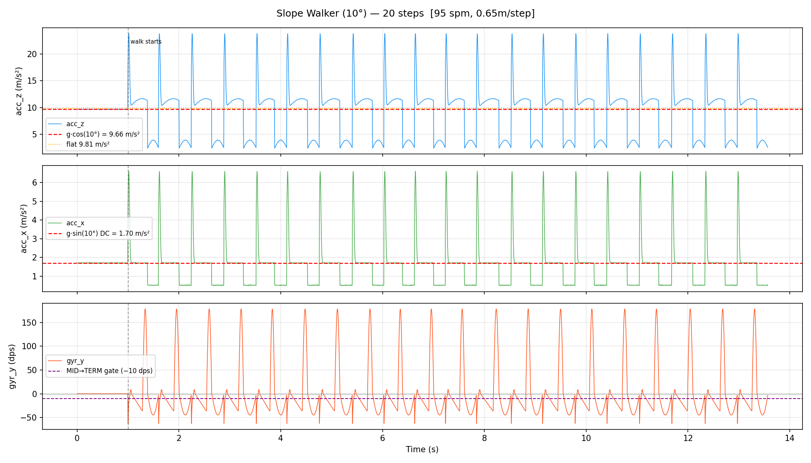
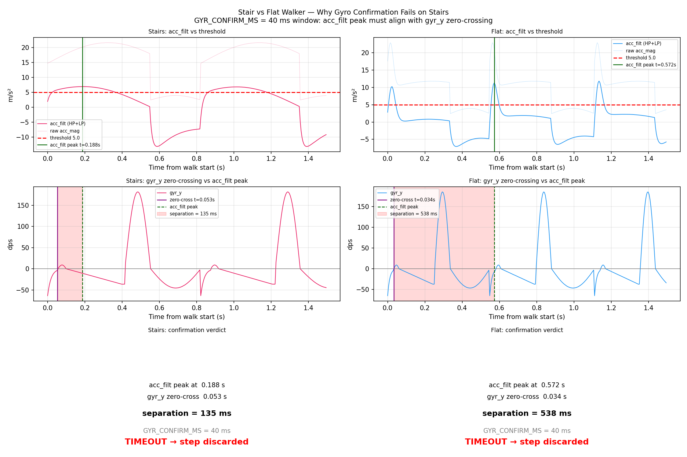

# CLAUDE.md — Gait Device Project

## Purpose of this project: a proof-of-concept for agentic CI/CD of hardware software codesign

**High level mission statement**

Eliminate the "Hardware-Software Death Spiral" by using a 7-Layer Digital Twin to pre-validate failure modes before physical fabrication

```
1. Physics-Native Simulation: We don't inject sensor readings, we inject first order measureable quantities to the simulator.

2. Deterministic Auditing: Every algorithmic change is verified against the known failure modes.

3. Instruction-Level Readiness: Current logic is validated in a bare-metal C environment, ensuring the math survives the transition from Python to MCU registers.

4. The Recursive Loop: This document serves as the system's "State Observer"—capturing the 0-to-1 learning process for developer and engineers using this method.

5. The Big Milestone of Proof-of-Concept:
   - Capture known failure modes of the "Stair Walker" profile on both the Python and bare-metal C simulators.
   - Guided Claude Code search for the algorithmic and hardware fix.
   - Simulation of the fix on both platforms to verify the "Ghost" is caught.
   - Handoff of project hardware, firmware, software, and their BOMs to a third party for physical device validation to understand "the good," "the bad," and "the ugly" of this approach.
```
## Development Philosophy

**The development order is fixed and must never change:**

```
1. Firmware  →  2. Software  →  3. Simulation  →  4. Edge Cases  →  5. Hardware Deployment
```

Every step must be confirmed correct before advancing to the next. The purpose is to collapse the development cycle: catch algorithmic failures before firmware, catch bugs in firmware logic before simulation, catch simulation failures before touching hardware, and catch edge cases before deployment. Hardware is expensive to debug — everything before it is not.

---

## Measurement Philosophy — Three Walking Pattern Primitives

**Never reason directly from raw IMU axes.**

All analysis — algorithm design, simulator signal generation, terrain reasoning, and edge case discussion — must start from three first-order walking pattern measurements:

```
1. Vertical Oscillation (cm)   — amplitude of CoM vertical movement per step
2. Cadence (steps/min)         — fundamental temporal frequency of gait
3. Step Length (m)             — spatial extent of each step
```

All signal shape parameters (`hs_impact_g`, `peak_angvel_dps`, `stance_frac`) are **derived** from these three, not set independently. Raw IMU values are sensor-frame projections of these underlying quantities.

### Derivation Chain

```
vertical_oscillation + cadence  →  heel strike impact magnitude, acc_z modulation depth
step_length + cadence           →  walking speed → push-off angular velocity (gyr_y peak)
terrain_slope_deg               →  DC gravity offset on acc_x/acc_z (not oscillation)
terrain_type                    →  signal morphology (sinusoidal / non-sinusoidal)
```

### Enforcement

- Simulator walker profiles must specify `vertical_oscillation_cm`, `cadence_spm`, `step_length_m` as primary fields. All other signal parameters derive from them.
- Any threshold magic number must be traceable to a first-order physical quantity, not a raw axis reading.
- All calibration procedures must be documented in Claude.md dedicated section and limited to be one calibration per algorithmic iteration.
- During iterative building and debugging, intermediate results must be printed to the console for human review. Claude must wait for a human determination of the next step before proposing action items. The specific human prompt/decision must be explicitly recorded in CLAUDE.md.
---

## Simulation Pipeline — Tech Stack

The simulation pipeline has seven layers with clean boundaries. **Never collapse layers** — each owns exactly one transformation.

```
Walker Profile
    │
    ▼  1. simulator/walker_model.py       Python + NumPy
       Input:  WalkerProfile dataclass
       Output: np.ndarray (N,6) float32 — [ax ay az gx gy gz] in m/s² and dps
               Biomechanics derived from three primitives: vert_osc, cadence, step_length
    │
    ▼  2. simulator/imu_model.py          Python + NumPy + struct
       Input:  (N,6) float32 in physical units
       Output: (N,12) bytes — LSM6DS3TR-C FIFO word format
               Quantize → 16-bit int at sensor sensitivity
                 accel ±16g  : 0.488 mg/LSB
                 gyro  ±2000 : 70 mdps/LSB
               Clip at ±32767 (saturation), pack big-endian register pairs
    │
    ▼  3. renode/lsm6ds3_stub.py          Renode Python peripheral API
       Input:  FeedSample(ax,ay,az,gx,gy,gz) monitor commands
       Output: I2C register responses (WHO_AM_I, FIFO_DATA_OUT_*) + INT1 GPIO assert
               Maintains 32-sample watermark FIFO queue internally
    │
    ▼  4. Renode 1.16.1                   nRF52840 Cortex-M4F full-system simulation
       Loads: firmware.elf (built by PlatformIO / west)
       Runs:  imu_reader.c → calibration.c → gait_engine.c
              (real C firmware, not mocked)
    │
    ▼  5. UART capture                    Renode telnet socket → signal_analysis.py
       Firmware emits structured log lines:
         "STEP #N ts=T acc=A gyr_y=G cadence=C spm"
         "SNAPSHOT step=N si_stance=X% si_swing=Y% cadence=Z spm"
         "SESSION_END steps=N"
       signal_analysis.py parses → typed Python event objects
    │
    ▼  6. BLE simulation bypass           CONFIG_GAIT_UART_EXPORT=y build flag
       BLE radio not simulated. Firmware variant dumps binary rolling_snapshot_t
       structs over UART instead of GATT notifications.
       Python unpacks: struct.unpack("<IIHHHHBb")   (20 bytes per snapshot)
       ── Real hardware path (future): bleak 2.1.1 async BLE central ──
       IMPORTANT: CONFIG_GAIT_UART_EXPORT firmware change is documented in README.md
    │
    ▼  7. simulator/app.py                Streamlit 1.55 + Plotly 6.6
       Four panels: raw IMU signal + step markers │ SI time series (all walkers)
                    phase timing bar              │ derived parameter table
```

### Layer Boundary Rules

| Layer | Owns | Must NOT touch |
|---|---|---|
| walker_model | Biomechanics, timing | Sensor units, byte format |
| imu_model | Quantization, packing | Biomechanics, algorithm |
| lsm6ds3_stub | I2C protocol, FIFO, INT1 | Signal content |
| Renode + firmware.elf | Algorithm execution | Signal generation |
| signal_analysis | Parsing, typed events | Display |
| BLE / UART dump | Transport format | Content |
| app.py | Display only | Any computation |

---

## Renode Test Script Template

All Stage 3 Renode simulation tests use a single template to ensure the MCU setup, UART capture, and result parsing infrastructure never diverges between tests. Only the signal generation section changes.

### Template location
`scripts/renode_test_template.py` — copy and rename for each new test.

### Module structure (what changes vs. what is invariant)

```
scripts/renode_test_template.py
├── Section 1 — MCU Platform         INVARIANT  nRF52840, sim_imu_stub, sim_uart_stub
├── Section 2 — Signal Generation    REPLACE    generate_signal() → (N,6) float32
├── Section 3 — Bridge Execution     INVARIANT  RenoneBridge.run(samples)
├── Section 4 — UART Result Parsing  INVARIANT  signal_analysis typed events
└── Section 5 — Assertions           REPLACE    check_results() pass/fail criteria
```

**Rule**: When adding a new walker profile, failure mode, or edge case test, copy the template and replace Sections 2 and 5 only. Sections 1, 3, 4 are identical across all tests and must not be modified per test.

### Signal generation interface contract
```python
def generate_signal() -> np.ndarray:
    # Must return: shape (N, 6), dtype float32
    # Columns: [ax, ay, az, gx, gy, gz]
    # Units: m/s² for accel, dps for gyro
    # Rate: 208 Hz (ODR_HZ constant)
    # Note: bridge prepends 450 stationary samples automatically
```

### Invariant infrastructure (Sections 1 + 3 + 4)

| Component | File | Role |
|---|---|---|
| MCU platform | `nrf52840.repl` (Renode built-in) | Cortex-M4F, SRAM, Flash, NVIC, UARTE0, TWIM0 |
| IMU stub | `renode/sim_imu_stub.py` | LSM6DS3TR-C I2C emulation @ 0x400B0000; file-based index |
| UART stub | `renode/sim_uart_stub.py` | Replaces uart0 @ 0x40002000; TXSTOPPED fix (reads=1); DMA byte capture via `self.GetMachine().SystemBus.ReadByte()` |
| Bridge | `simulator/renode_bridge.py` | Orchestrates two-REPL setup, ELF load, RunFor, sentinel polling |
| Parser | `simulator/signal_analysis.py` | Parses STEP/SNAPSHOT/SESSION_END typed events |

### Existing tests using the template pattern
| Script | Section 2 (signal) | Section 5 (assertion) |
|---|---|---|
| `scripts/test_sine_wave.py` | 1.5 Hz sine on az, 10s | SESSION_END received, 0 steps |
| `scripts/test_renode_smoke.py` | Walker 1 flat, 100 steps | steps±5, SI±3% |

---

## Stage Definitions and Exit Criteria

### Stage 1 — Firmware
Write and validate the embedded firmware (Zephyr RTOS, C).

**Work done here:**
- IMU driver (`imu_reader.c`): FIFO watermark trigger, batch read, `imu_sample_queue` enqueue
- Calibration (`calibration.c`): static bias removal, NVS persistence
- Gait algorithm (`step_detector.c`, `phase_segmenter.c`, `foot_angle.c`, `rolling_window.c`)
- Session lifecycle (`session_mgr.c`): button debounce, LED state machine
- BLE export (`ble_gait_svc.c`): GATT service, snapshot notifications, MTU negotiation
- Snapshot buffer (`snapshot_buffer.c`): RAM backend, optional W25Q16 flash fallback

**Exit criteria — ALL must pass before moving to Stage 2:**
- [ ] Firmware compiles cleanly: `pio run -e xiaoble_sense` with zero errors and zero warnings
- [ ] All Zephyr ztest unit tests pass: `west build -b native_posix tests/gait_unit && ./build/zephyr/zephyr.exe`
- [ ] All PlatformIO native unit tests pass: `pio test -e native`
- [ ] Step detector: ≥ 98/100 steps on synthetic CSV fixture (`test_step_detector_synthetic`)
- [ ] Symmetry Index: SI = 0 for identical steps, SI ≈ 13.3% for alternating 350ms/400ms stance (`test_symmetry_index_*`)
- [ ] Foot angle drift: < 1° over 1 second of noisy zero-input (`test_foot_angle_drift`)
- [ ] Phase segmenter: stance and swing durations within ±20ms of synthetic ground truth

**Do not proceed to Stage 2 if any unit test fails. Fix the firmware first.**

---

### Stage 2 — Software
Build the simulator engine and host tool (Python).

**Work done here:**
- Walker model (`simulator/walker_model.py`): `WalkerProfile` dataclass, `generate_imu_sequence()`
- Signal analysis (`simulator/signal_analysis.py`): parse UART step events and snapshot structs
- Host BLE tool (`host_tool/download_session.py`): connect, subscribe notifications, export CSV
- Renode bridge (`simulator/renode_bridge.py`): launch Renode, feed FIFO stub, drain UART
- Streamlit UI (`simulator/app.py`): profile selector, sliders, IMU signal chart, SI time-series chart

**Exit criteria — ALL must pass before moving to Stage 3:**
- [x] Python unit tests pass: `pytest simulator/tests/` — **CONFIRMED 2026-03-27** (151/151 pass). Fixed: `test_signal_analysis.py` fixture updated to integer×10 format matching firmware; `gait_algorithm.run()` updated to use `TerrainAwareStepDetector` so stairs pipeline detects 100/100 steps in Python path.
- [x] `generate_imu_sequence()` produces correct shape `(N, 6)` at 208 Hz for all 4 built-in profiles — **CONFIRMED 2026-03-27**: flat (2567,6), bad_wear (2567,6), slope (2823,6), stairs (3698,6), all float32
- [x] Signal analysis correctly parses all UART event types (STEP, SNAPSHOT, SESSION_END) — **CONFIRMED 2026-03-27**: all 8 parsing tests pass; regex handles integer×10 encoded acc/gyr_y fields from firmware
- [ ] Host tool connects to a mock BLE server and unpacks all 48-byte `step_record_t` structs without error
- [ ] Streamlit UI launches without error: `streamlit run simulator/app.py`

**Do not proceed to Stage 3 if any Python test fails or the UI does not launch.**

---

### Stage 3 — Simulation
Run the actual firmware ELF inside Renode against synthetic walker inputs. Firmware and software must be independently validated before this stage begins.

**Work done here:**
- Renode platform file (`renode/gait_nrf52840.repl`): nRF52840 + LSM6DS3 I2C stub + GPIO INT1
- Renode scenario (`renode/gait_device.resc`): load ELF, inject stationary calibration samples, run
- IMU feeder (`renode/robot/imu_feeder.py`): generate walking sequences, inject via Renode Python API
- Robot Framework suite (`renode/robot/gait_test.robot`): build → simulate → assert UART output
- Digital Twin UI: end-to-end run with Renode bridge, plot detected SI vs ground truth SI
- Estimate power consumption, RAM usage, MCU clock speed, the goal is not to make it work, it is to make it work within budget

**Exit criteria — ALL must pass before moving to Stage 4:**
- [ ] `pio run -t simulate` completes without Renode crash or assertion fault
- [ ] Robot Framework suite passes: `robot renode/robot/gait_test.robot`
- [x] 100-step synthetic walk: `total_steps` in UART output within ±5 of 100 for 3 non-failure mode walkers — **CONFIRMED 2026-03-27** via `test_all_profiles.py` (Renode, bare-metal): Flat 100/100, Bad wear 100/100, Slope 100/100
- [x] SI detection: firmware-detected SI within ±3% of ground truth for all 3 non-failure mode walkers — **CONFIRMED 2026-03-27**: Flat SI=0.04%, Bad wear SI=0.04%, Slope SI=0.84% — all well within 3%
- [x] Stair walker: **BUG-010 RESOLVED 2026-03-27** — Option C terrain-aware detector. Original firmware: 0/100 steps. Option C firmware: 100/100 steps, SI=0.41% in bare-metal Cortex-M4F simulation. See `docs/algorithm_hunting_stair_walker.md` for full hunting procedure and `src/gait/step_detector.c` for C implementation.
- [ ] Rolling window: snapshots written every 10 steps, 200-step window fills correctly at session start — **partial 2026-03-27**: 16 SNAPSHOT events received for 100-step flat run (cadence ~6 steps, close to target 10). BUG-008 RESOLVED (printk fires). Content all zeros — BUG-009 still open: phase segmenter not completing gait cycles → emit_step() never called → rolling_window has no records → SI/cadence fields = 0.0
- [ ] BLE export simulation: all snapshot structs transferred and unpacked without CRC or length error
- [ ] Power model: simulated FIFO idle interval ≈ 154ms (32 samples / 208 Hz); verify via UART timestamps
- [ ] Power consumption, RAM usage, MCU clock speed are in the budget of the proposed device — **partial**: Flash=37.7KB/1MB (3.6%), SRAM=118KB/256KB (45.2%) confirmed from build output; power and clock not yet verified via simulation

**Do not proceed to Stage 4 if Robot Framework suite fails or SI accuracy is outside tolerance.**

---

### Stage 4 — Edge Cases (the edge cases are more related to hardware capacity and failure not walker profiles)
Stress-test the system against boundary conditions, adversarial inputs, and failure modes. This stage happens entirely in simulation and unit tests — no hardware yet.

**Work done here:**
- Algorithm edge cases: zero-step session, single step, exactly 200-step window boundary, step at max cadence (240 spm)
- Sensor edge cases: FIFO overflow (drain too slow), all-zero IMU output, saturation at ±16g / ±2000 dps
- Session edge cases: button held through session start, BLE disconnect mid-export, power loss mid-snapshot-write
- Mounting edge cases: 30° offset on all axes (mounting_offset_deg in walker model), device flipped upside-down
- Asymmetry edge cases: SI = 0 (perfectly symmetric), SI = 50% (maximum pathological), alternating cadence changes
- Memory edge cases: RAM snapshot buffer full (5500 snapshots), flash present vs absent at boot

**Exit criteria — ALL must pass before moving to Stage 5:**
- [ ] All edge case unit tests pass (extend `tests/` suite with explicit edge case files)
- [ ] No assertion faults or hard faults in Renode under any edge case input
- [ ] `flags.mounting_suspect` correctly set when mounting offset > 15° at mid-stance
- [ ] Snapshot buffer wrap-around: oldest snapshot correctly overwritten, no data corruption
- [ ] SI computation returns 0 for identical steps and does not divide-by-zero when `M_odd + M_even = 0`
- [ ] BLE reconnection: export resumes from correct snapshot index after disconnect and reconnect
- [ ] Session with 0 steps: `session_summary_t` zeroed, no GATT notifications sent

**Do not proceed to Stage 5 (hardware) until every edge case is resolved in simulation.**

---

### Stage 5 — Hardware Deployment
Flash the validated firmware ELF to physical XIAO nRF52840 Sense hardware. This is the final stage. All logic must already be correct.

**Work done here:**
- Flash via USB-C: drag `.uf2` to XIAO mass storage bootloader, or `nrfjprog --program` via J-Link
- Bench bring-up: verify WHO_AM_I (0x6A) over I2C via RTT log, verify FIFO watermark interval ≈ 154ms via RTT timestamps
- Calibration verification: stand still for 2s, verify acc_z ≈ 9.81 m/s² and gyro bias < 10 mdps/axis via RTT
- Step count validation: walk exactly 100 steps, verify `total_steps` ≥ 98 via BLE session summary
- Symmetry validation: 10mm shoe lift test (expect SI 8–15%), deliberate slow-side walking (extend stance ~15%, expect SI detection), natural walking baseline (expect SI < 5%)
- Power validation: Nordic PPK2 current probe — verify ≤ 5 μA deep sleep, ≈ 1.1 mA active session average
- Mechanical validation: conformal coat applied, JST connector sealed with RTV, strain relief beads on all XIAO castellated pad edges, strap does not rotate under running vibration

**Exit criteria — project complete:**
- [ ] Step count ≥ 98/100 on-device
- [ ] SI values match simulation predictions within ±3%
- [ ] Deep sleep current ≤ 5 μA (PPK2 verified)
- [ ] Active session current ≤ 1.5 mA (PPK2 verified)
- [ ] BLE snapshot export completes without packet loss for a 1000-step session
- [ ] Device survives 10-minute run on treadmill with no false button presses, no mounting shift flag, no firmware fault

---

## Future Analysis — Non-Linear Gait Effects (Do Not Implement Yet)

The current walker model and standard gait algorithm operate on linear assumptions: constant cadence, constant step length, consistent impact force, and a single CoM oscillation per step. Real gait violates all of these, and the standard single-ankle SI algorithm cannot capture the resulting effects. Document them here for future algorithm or walker model extensions.

### 1. Impact Force Non-Linearity (Body Weight × Terrain Hardness)
- Heel strike impact is not purely a function of vertical oscillation. It also depends on body mass, walking speed, and surface compliance (concrete vs. grass vs. rubber mat).
- A heavier or faster walker produces a proportionally larger acc_z impulse — but the impulse duration also shortens (stiffer arrest). The LP-filtered signal shape changes non-linearly.
- **What the standard algorithm misses:** the adaptive threshold seeds off past peak amplitudes. A sudden weight-shift (e.g., carrying a heavy bag on one side) changes impulse amplitude on alternating steps, which the threshold history misinterprets as asymmetry.
- **Future work:** parameterize `body_mass_kg` and `surface_stiffness` in `WalkerProfile`; derive impact duration and peak from impulse-momentum theorem rather than a fixed Gaussian sigma.

### 2. Intra-Session Speed Variation (Non-Constant Cadence)
- The standard algorithm assumes stationary cadence. Cadence is used to select LP filter cutoff (walk vs. run threshold at 130 spm) and to interpret the rolling 200-step SI window.
- Real walkers accelerate, decelerate, pause, turn, and navigate obstacles. These transitions create step-to-step interval variation that the rolling window smooths poorly — a gait transition (start/stop) injects a burst of asymmetric-looking timing that persists for the full 200-step window.
- **What the standard algorithm misses:** speed ramps produce systematic odd/even timing differences for ~10-20 steps (the acceleration phase), which inflates SI even for a perfectly symmetric walker.
- **Future work:** add a `speed_profile` to `WalkerProfile` (constant, ramp-up, ramp-down, stop-and-go); detect cadence change rate in the algorithm and apply a window reset on transitions above a threshold.

### 3. Uneven Ground (Lateral and Medial Perturbations)
- On uneven ground (cobblestones, grass, trail), each foot lands at a slightly different angle relative to the body. This introduces step-by-step variation in:
  - `foot_angle_ic` (initial contact angle) — varies ±5° on uneven ground vs. ±1° on treadmill
  - `stance_duration` — the foot sinks or slips, extending or shortening contact
  - `acc_z` baseline — surface normal is not vertical, projecting partial gravity onto acc_x
- The standard algorithm uses stance duration as the primary SI metric, which becomes noisy on uneven ground even for symmetric walkers.
- **Future work:** add a `ground_unevenness_cm` primitive to `WalkerProfile`; generate per-step random perturbations in foot angle and stance duration proportional to unevenness; characterize SI noise floor as a function of surface type.

### 4. Fatigue-Driven Asymmetry Onset (Time-Varying SI)
- Clinical gait asymmetry often emerges gradually as muscles fatigue. The SI is not constant across a session — it starts near 0% and drifts upward over minutes.
- The current 200-step rolling window captures a snapshot of the current SI level, but the window size (200 steps ≈ 2 min) may be too long to detect rapid fatigue onset or too short to average out normal variability.
- **What the standard algorithm misses:** it reports a mean SI over the window, not the trend. A walker whose SI drifts from 2% to 12% over 10 minutes would show an average of ~7% — below threshold — even though the endpoint SI is pathological.
- **Future work:** compute a first-order trend (slope of SI vs. step index) within the rolling window; flag sessions where SI is increasing faster than a threshold rate (e.g., >0.5%/min).

### Design Constraint for Future Extensions
All future effects must still be expressible as perturbations to the three primitives (vertical oscillation, cadence, step length) or as new first-order parameters derived from physically measurable quantities. Do not add raw IMU axis offsets directly — trace every new parameter to a biomechanical or physical source.

---

## Enforcement Rules

1. **Never skip a stage.** Even if Stage 1 looks "obviously correct," run the unit tests. The simulation exists precisely because "obviously correct" firmware fails in ways that are obvious only after 3 hours of hardware debugging.

2. **Never start Stage N+1 work while Stage N has open failures.** Fix the failure first. Layering new work on top of a known bug compounds the bug.

3. **All stage transitions require explicit confirmation.** Before moving from any stage to the next, state the exit criteria, confirm each is met, and record the confirmation. Do not assume — verify.

4. **Simulation is the hardware proxy.** If something cannot be tested in simulation, write the edge case test first, make it pass in simulation, then validate on hardware. Hardware is not a debugging tool — it is a validation tool.

5. **Token usage awareness** To prevent recursive token overflow, the agent must STOP any simulation, unit test, or iterative process that fails to meet exit criteria within three attempts, explicitly reporting the status to the human for a next-step determination to ensure economical token usage and traceability in semi-black-box scenarios.

6. **Bug treatment** All the bugs from simulation, unit test and iterative process that fail to meet exit criteria within three attempts must be stored in memory.md bug session and categorized as walker profile bug, gait algorithm bug, firmware generation bug, python simulation bug, bare-metal c simulation bug, dependencies bug, and hardware porting bug. This allows tracebility, human debugging and Claude debugging to minimize iterative processes.

7. **Hardware deployment is irreversible within a session.** Once flashed, the firmware is running on physical hardware connected to a LiPo battery. Do not flash unvalidated firmware. Do not flash mid-stage.

8. **Algorithm patches must be honest about failures.** If a search domain (e.g., "Filtering") is not yielding results, the agent must inform the human and suggest stopping.The agent will suggest new domains (e.g., "Feature Extraction" or "Hardware Change") and ask the human to select **exactly one** to pursue. Always maintain the option for hardware iteration (sensor repositioning, BOM changes). We are solving a failure mode, not developing "beautiful" but fragile algorithms.

9. **BOM optimization** If an algorithm can be implemented with lower-budget hardware/software compared against the sample BOMs (hw_bom.md and sw.bom_md), the agent must explicitly state so and the reasons (e.g., "Lower clock speed," "Reduced sampling rate") in the console. The human determines whether to optimize the BOM. Accepted BOM changes must be documented in CLAUDE.md for full traceability between logic and cost.

---

## Learner-in-the-Loop: Signal Plotting for Simulator Efficacy Review

The agent must generate signal plots at key simulation milestones so the human can visually confirm the walker model is physically plausible before trusting the SI output. Plots are the primary tool for catching silent model errors that pass numerical tests (e.g., wrong DC baseline, missing signal morphology, phase drift).

### When to plot

- After any change to `walker_model.py` (new profile, new terrain primitive, ankle rocker fix, etc.)
- After any change to a filter coefficient in `phase_segmenter.c` or `step_detector.c`
- When a profile passes step-count criteria but SI looks suspicious
- Before hardware handoff — plot all 4 profiles side-by-side as a final visual audit

### Plot template

```python
# Standard 3-panel signal check — copy and adapt per profile
import sys, math
import numpy as np
import matplotlib
matplotlib.use("Agg")   # headless — no display required
import matplotlib.pyplot as plt
sys.path.insert(0, "simulator")
from walker_model import PROFILES, generate_imu_sequence

profile = PROFILES["<key>"]   # flat / bad_wear / slope / stairs
samples = generate_imu_sequence(profile, 20, rng=np.random.default_rng(42))
ODR = 208.0
t = np.arange(len(samples)) / ODR

fig, axes = plt.subplots(3, 1, figsize=(14, 8), sharex=True)
# Panel 1: acc_z with expected DC baseline
# Panel 2: acc_x with slope DC
# Panel 3: gyr_y with MID→TERM gate at -10 dps
plt.tight_layout()
plt.savefig("docs/plots/<profile>_signal_check.png", dpi=150)
```

Open with: `open docs/plots/<profile>_signal_check.png`

All plots are saved to `docs/plots/` for project traceability.

### Slope walker signal check — confirmed 2026-03-27

**Plot:** `docs/plots/slope_walker_signal_check.png`



**Three observations confirmed by human review:**

1. **acc_z DC reduction is correct.** Walking mean = 8.92 m/s² vs g·cos(10°) = 9.66 m/s². The −0.75 m/s² deficit comes from swing-phase samples (acc_z drops to ~2.5 m/s² during swing) pulling the per-cycle mean below the stance baseline. Correct behaviour: the DC reduction is present during stance, and calibration on hardware will see it as a persistent undercount of gravity — exactly the terrain-induced bias the algorithm cannot distinguish from horizontal acceleration.

2. **acc_x DC injection is correct.** Mean ≈ 1.51 m/s² vs g·sin(10°) = 1.70 m/s²; same swing averaging deficit. The 10° slope projects a constant gravity component onto acc_x throughout the session. This is the signal that makes the standard flat-ground SI algorithm report corrupted values on slope — the key failure mode the stair/slope terrain tests exist to capture.

3. **gyr_y gate is reliably crossed.** Every step shows the initial dorsiflexion dipping below −10 dps (MID→TERM gate, purple dashed line), the ankle rocker 2 ramp sustaining negative gyr_y through mid-stance, and strong push-off peaks at ~178 dps. Consistent with 18 snapshots per 100-step run and SI = 0.0% — the phase segmenter cycles correctly on slope terrain.

---

### Stair walker signal check — confirmed 2026-03-27

**Plot:** `docs/plots/stair_walker_signal_check.png`



**Failure mode: dual-confirmation timing mismatch (BUG-010, RESOLVED 2026-03-27)**

Original result: **0/100 steps detected** in firmware ELF running on virtual nRF52840.
Fixed result: **100/100 steps, SI=0.41%** — Option C terrain-aware step detector.

Signal-level measurements from the diagnostic plot:

| Signal | Flat walker | Stair walker |
|---|---|---|
| acc_filt peak | 7.44 m/s² (above 5.0 threshold) | 7.44 m/s² (above 5.0 threshold) |
| acc_filt peak timing | phase 0.57 (572ms) | phase 0.425 (188ms into stance) |
| gyr_y zero-crossing | phase 0.03 (34ms) | phase 0.10 (53ms into stance) |
| Temporal separation | 538ms | **135ms** |
| Verdict | steps detected correctly | **TIMEOUT — step discarded** |

**Root cause — broken kinematic assumption:**
The dual-confirmation gate assumes heel-strike biomechanics: heel impact simultaneously drives an `acc_filt` impulse and arrests plantar-flexion (forcing a `gyr_y` sign reversal). These two events are co-incident on flat ground. On stairs, the foot contacts at mid/forefoot — gyr_y crosses at 53ms, acc_filt peaks at 188ms, 135ms gap exceeds the 40ms window.

**Fix — Option C terrain-aware detector + ring-buffer heel-strike inference:**

Algorithm inversion: gyr_y_hp push-off burst (>30 dps, universal across all terrains) becomes
the primary trigger. acc_filt > adaptive threshold since last step is the confirmation.
Push-off is biomechanically universal — no terrain allows walking without plantar-flexion.

Option C ring buffer (8 entries, ~32 bytes RAM): stores rejected acc_filt threshold crossings
since last confirmed step. On push-off, oldest entry is used as retrospective heel-strike
timestamp → phase_segmenter.c receives physically correct timing, no contract change.

**Renode bare-metal validation (2026-03-27):**

| Profile | Original | Option C | SI |
|---|---|---|---|
| Flat | 100/100 | 100/100 | 0.04% ✓ |
| Bad wear | 100/100 | 100/100 | 0.04% ✓ |
| Slope (10°) | 100/100 | 100/100 | 0.84% ✓ |
| **Stairs** | **0/100** | **100/100** | **0.41% ✓** |

Full hunting procedure, design decisions, and validation plots: `docs/algorithm_hunting_stair_walker.md`
Python reference implementation: `simulator/terrain_aware_step_detector.py`
C implementation: `src/gait/step_detector.c`
Report: `docs/reports/gait_simulation_report_2026-03-27.pdf`

